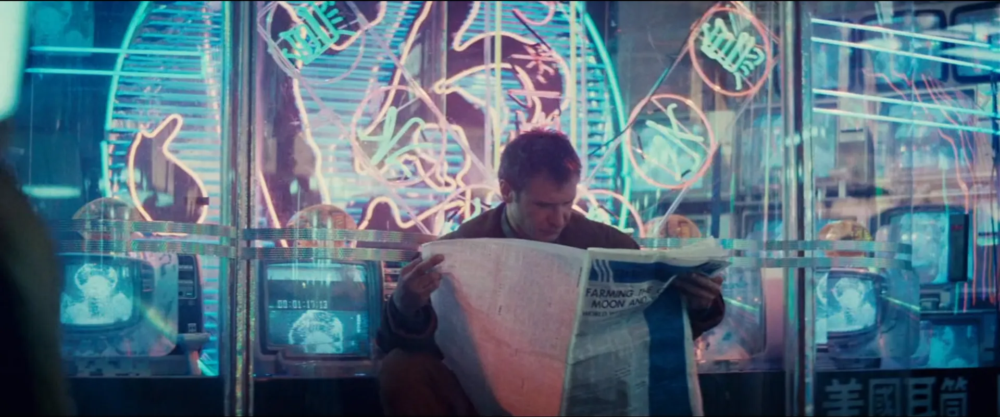
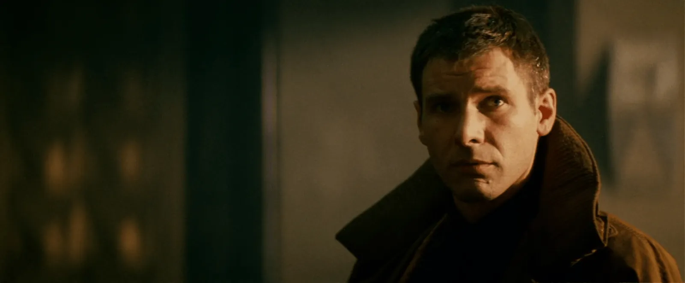
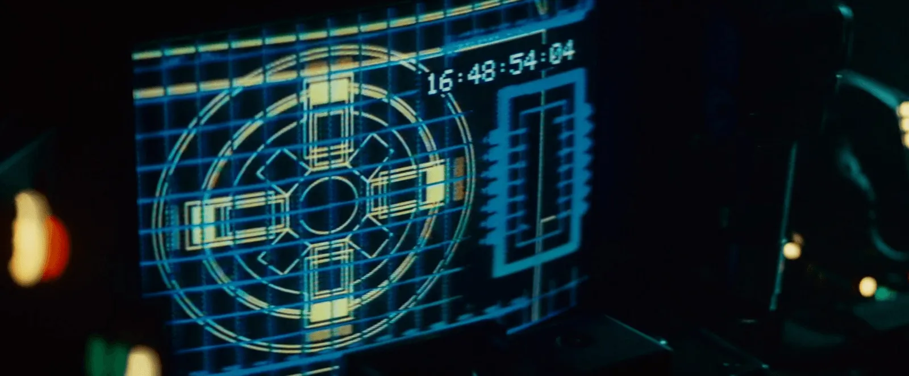
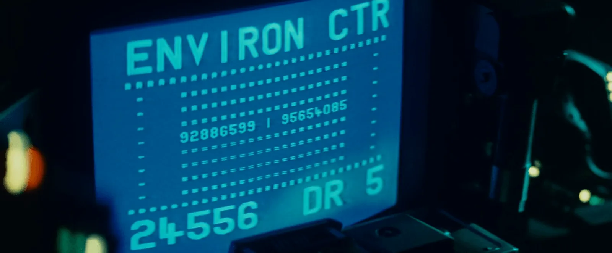
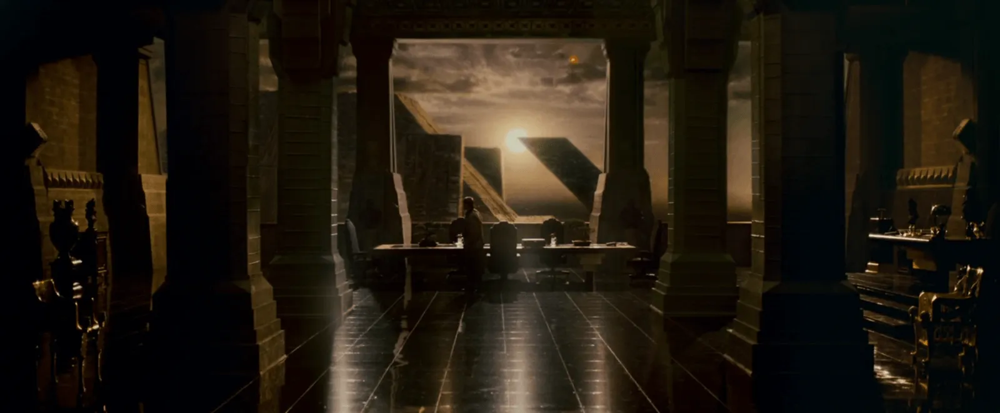
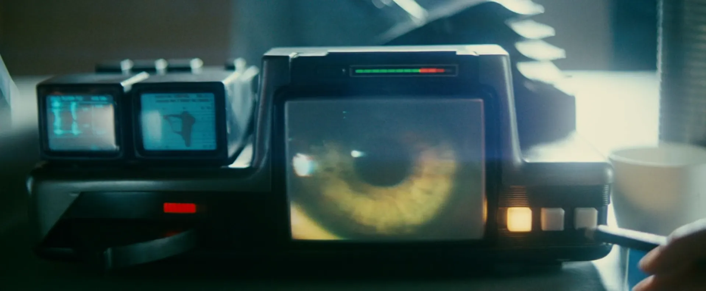

# Deckard Dev (Omarchy)

Blade Runner-inspired blue/teal theme tuned for a Hyprland Wayland setup and common CLI tools. Includes matching wallpapers (`backgrounds/`) and previews (`preview.png`, `preview2.png`).

This exists because I wanted a clean neon noir look inside Omarchy without muddy contrast. The palette keeps text sharp against a deep navy base, with teal and violet highlights to make chrome and prompts glow without eye strain.


## What’s included
- Hyprland: soft shadows, rounded corners, gap tuning (`hyprland.conf`)
- Hyprlock colors for ring/text (`hyprlock.conf`)
- Waybar/menus: Waybar, Wofi, Walker, SwayOSD, Mako styles aligned to the palette (`waybar.css`, `wofi.css`, `walker.css`, `swayosd.css`, `mako.ini`)
- Terminals: Alacritty (`alacritty.toml`), Kitty (`kitty.conf`), Ghostty (`ghostty.conf`), Warp (`warp.yaml`)
- Apps/tools: Aether/GTK overrides (`aether.override.css`), Chromium theme tint (`chromium.theme`), btop theme (`btop.theme`)
- Neovim: Aether colorscheme snippet for LazyVim (`neovim.lua`)
- Icons: pointer to Yaru-blue (`icons.theme`)
- Wallpapers: `backgrounds/deckard.png`, `deckard-owl.png`, `elevation-check.png`, `environ-center.png`, `tyrell-sanctum.png`, `voight-kampff.png`

## Quick start
Run the Omarchy installer to place everything where it belongs:

```bash
omarchy-theme-install https://github.com/OldJobobo/omarchy-deckard-dev
```

Wallpapers live in `backgrounds/`; `preview.png` and `preview2.png` show the intended look.

## Background previews
<table>
  <tr>
    <td align="center" valign="top"><br><sub>deckard.png</sub></td>
    <td align="center" valign="top"><br><sub>deckard-owl.png</sub></td>
    <td align="center" valign="top"><br><sub>elevation-check.png</sub></td>
  </tr>
  <tr>
    <td align="center" valign="top"><br><sub>environ-center.png</sub></td>
    <td align="center" valign="top"><br><sub>tyrell-sanctum.png</sub></td>
    <td align="center" valign="top"><br><sub>voight-kampff.png</sub></td>
  </tr>
</table>

## Notes
- Hyprland uses deep shadows and moderate gaps; adjust `gaps_out`/`gaps_in` in `hyprland.conf` if you prefer tighter layouts.
- Palette anchors: background `#001e49`, foreground `#eef1d7`, teal accent `#1fb1a5`, violet accent `#4b64fd`, highlight cyan `#83f0f1`. All configs reuse these for consistency.
